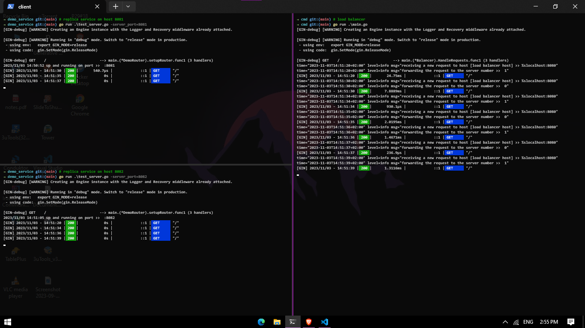
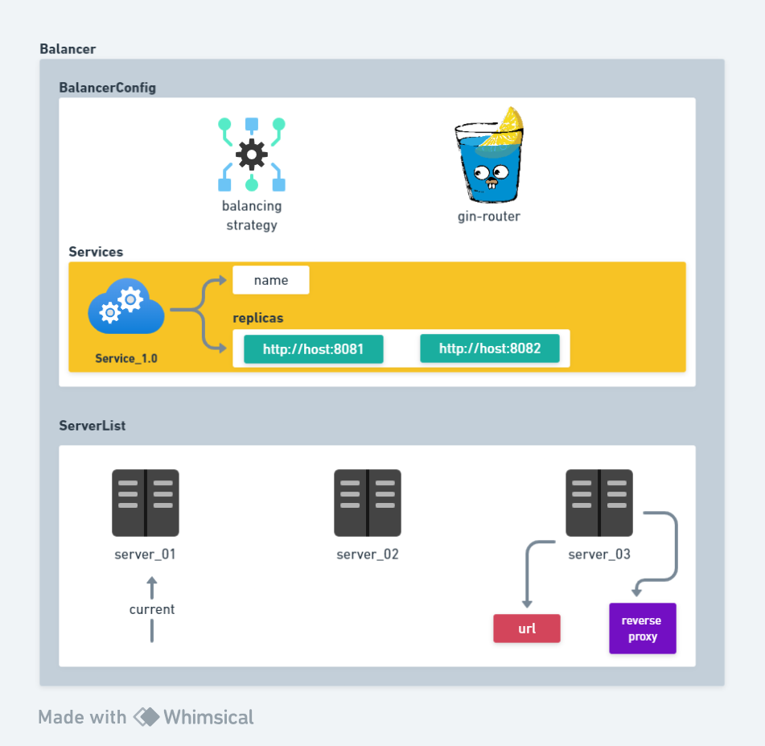

# gobalancer
GoBalancer is a load-balancer project written in golang for distributed systems.

## features.v1.0
➜ The laod-balancer is working with 2 services   
➜ The load-balancer cannot handle when a service shutsdown  

## architecture.v1.0
